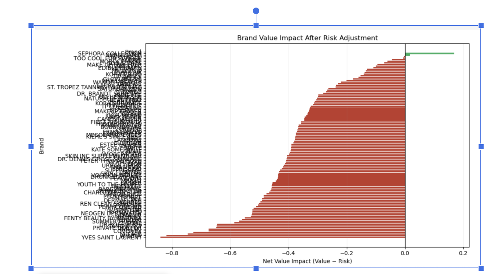
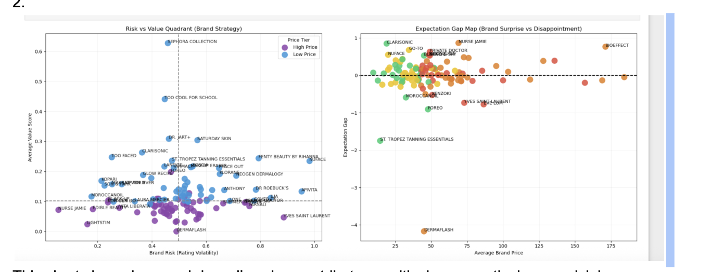
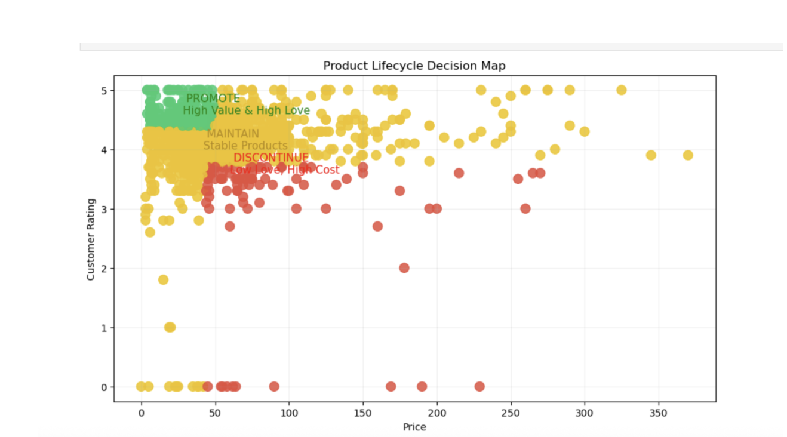
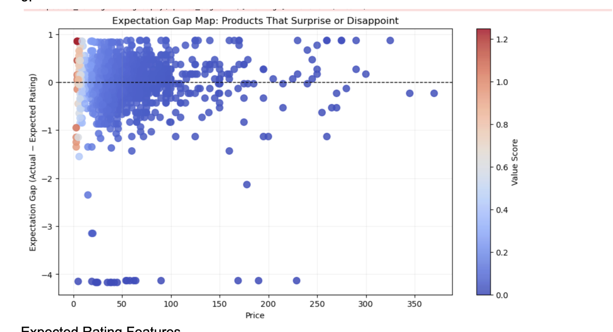
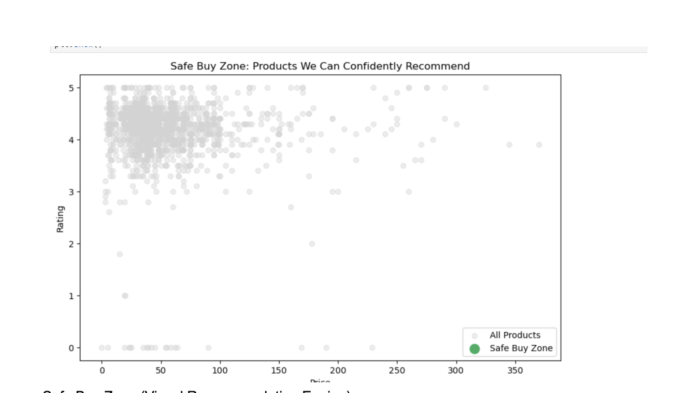
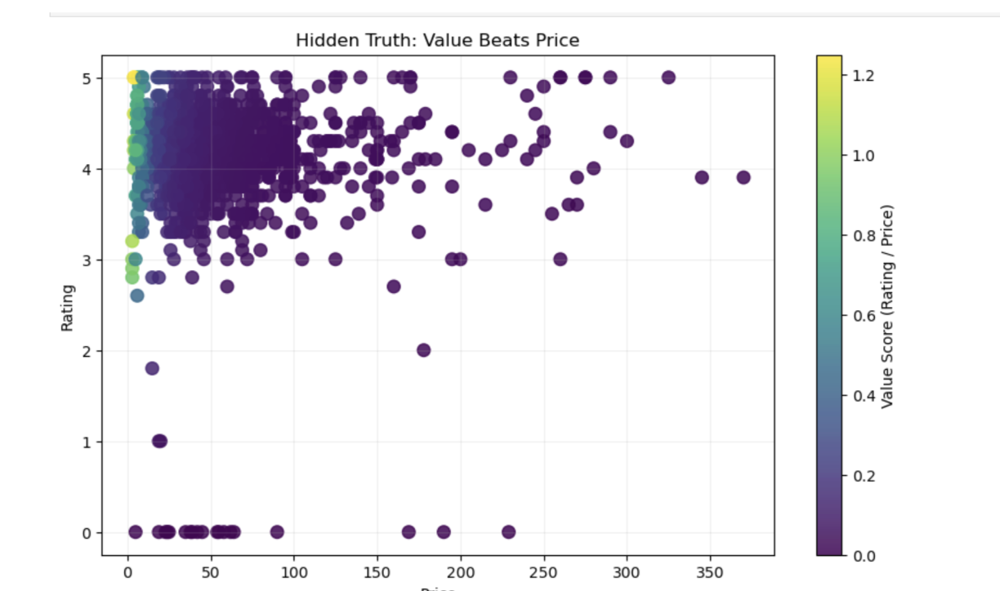
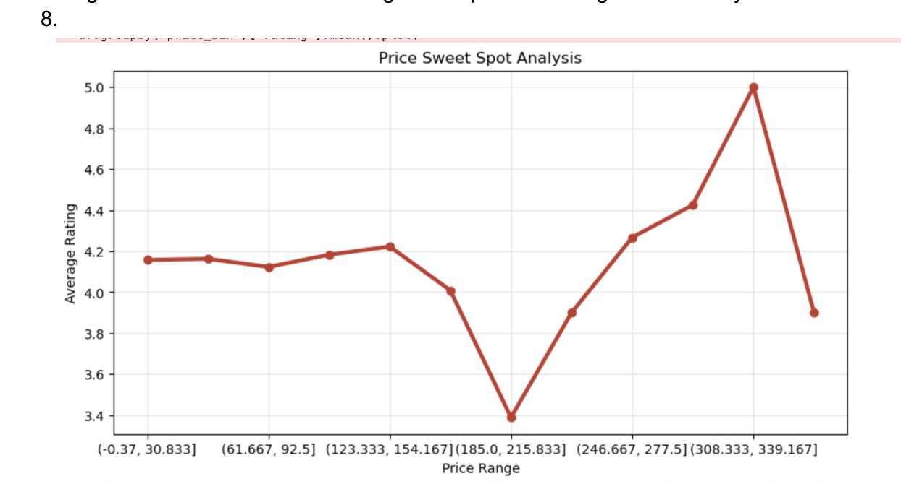
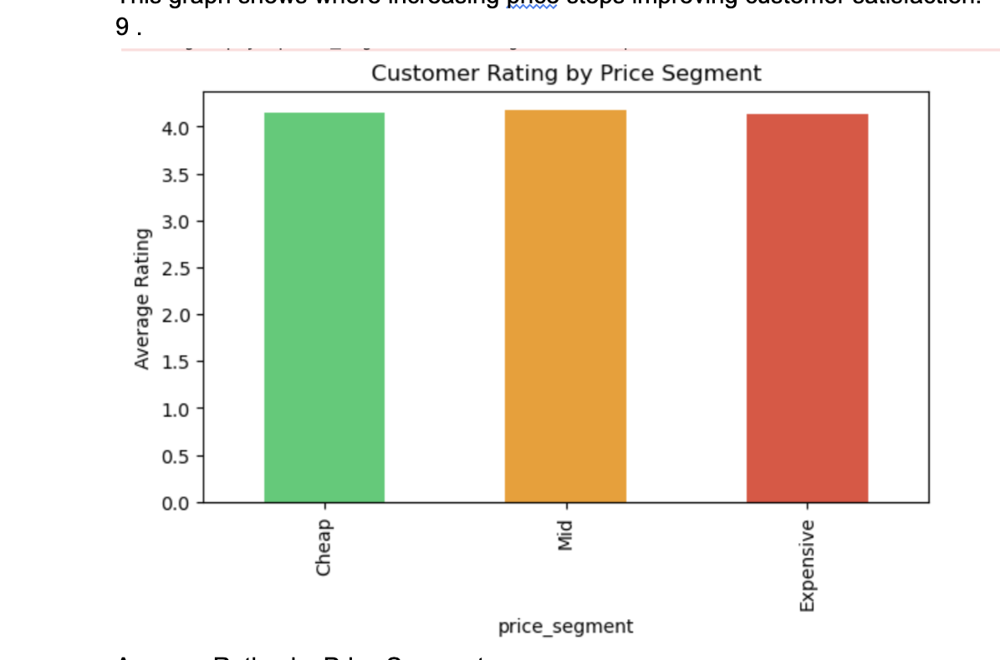

<div align="center">


<br/>


<br/>

> **An end-to-end data and analytics project evaluating 1,400+ cosmetic products.**  
> From raw SQL validation → advanced Python EDA → executive-level strategy visualizations.

---

</div>

## 🌸 Project Overview

This repository focuses on identifying **"Value Creators"** in the beauty industry. By analyzing the relationship between **price**, **chemical ingredients**, and **user ratings**, the project pinpoints which brands provide the best ROI for consumers — and which carry the highest **"Expectation Gap."**

<div align="center">

| 🎯 Goal | 🔬 Method | 📈 Output |
|:---:|:---:|:---:|
| Identify high-value beauty brands | SQL validation + Python EDA | Executive strategy report |
| Map consumer satisfaction vs. price | Correlation & clustering analysis | Investment-grade visualizations |
| Detect "Expectation Gap" products | Rating deviation modeling | Safe-Buy recommendation engine |

</div>

---

## 🛠️ Technical Stack

<div align="center">

| Layer | Tool | Purpose |
|:---|:---:|:---|
| 🗄️ **Database** | SQLite | Data validation & Performance Gap Analysis |
| 🐍 **Language** | Python 3.x | Data processing & EDA |
| 📊 **Libraries** | Pandas, NumPy, Matplotlib, Seaborn | Analysis & visualization |
| 📄 **Documentation** | PDF Reports | SQL Schema & Strategic Business Report |

</div>

---

## 🔍 Key Analytical Phases

### 🗃️ Phase 1 — SQL Data Validation & Aggregation

<details open>
<summary><b>📌 1. Pricing Strategy Analysis</b></summary>

<br/>

The dataset reveals that the cosmetics market is **heavily dominated by mid-range products**, with a balanced presence of budget and luxury segments.

- The mid-range segment has the **highest product concentration**, indicating strong competition
- Luxury products exist but do not dominate the catalog
- Budget products maintain a steady presence, suggesting accessibility is important

> 💼 **Business Interpretation:** Brands are strategically positioning themselves in the mid-price segment to maximize reach and competitiveness, rather than focusing solely on premium pricing.

```sql
SELECT price_segment, COUNT(*) AS product_count
FROM cosmetics_clean
GROUP BY price_segment;
```

</details>

---

<details open>
<summary><b>⭐ 2. Customer Satisfaction & Rating Behavior</b></summary>

<br/>

Customer ratings are consistently high across the dataset, with an **average above 4.0**.

- Overall strong product satisfaction across all segments
- Mid-range products often **match or outperform** luxury products
- Budget products also maintain highly competitive ratings

> 💼 **Business Interpretation:** There is no strong correlation between price and customer satisfaction. Customers prioritize **effectiveness and value**, not just brand prestige.

```sql
-- Average rating
SELECT ROUND(AVG(rating), 2) AS average_rating
FROM cosmetics_clean;

-- Price vs rating
SELECT price_segment,
       ROUND(AVG(rating), 2) AS avg_rating,
       COUNT(*) AS product_count
FROM cosmetics_clean
GROUP BY price_segment
ORDER BY avg_rating DESC;
```

</details>

---

<details open>
<summary><b>🏷️ 3. Brand Performance & Market Positioning</b></summary>

<br/>

The dataset shows that a few brands dominate in terms of product count, but:

- High product volume **does not guarantee** higher ratings
- Some smaller brands compete effectively with far fewer products

> 💼 **Business Interpretation:** Success in the cosmetics industry depends more on **product quality and consistency** than sheer catalog size.

```sql
SELECT brand, COUNT(*) AS product_count
FROM cosmetics_clean
GROUP BY brand
ORDER BY product_count DESC;
```

</details>

---

<details open>
<summary><b>🧴 4. Product Inclusivity (Skin-Type Coverage)</b></summary>

<br/>

Products supporting multiple skin types (dry, oily, sensitive):

- Tend to have **slightly higher prices**
- Maintain **strong ratings** consistently
- Represent a large and growing portion of the dataset

> 💼 **Business Interpretation:** Inclusivity is a key product differentiation strategy. Brands investing in broader skin-type coverage see increased value perception and market reach.

```sql
-- Feature engineering
UPDATE cosmetics_clean
SET skin_type_coverage = normal + dry + oily + sensitive;

-- Distribution
SELECT skin_type_coverage, COUNT(*) AS product_count
FROM cosmetics_clean
GROUP BY skin_type_coverage
ORDER BY skin_type_coverage DESC;
```

</details>

---

<details open>
<summary><b>💎 5. Value-for-Money Analysis</b></summary>

<br/>

By calculating a **price-efficiency metric** (rating ÷ price):

- The best value products are mostly **mid-range or affordable**
- Luxury products rarely dominate value rankings

> 💼 **Business Interpretation:** Customers can achieve high satisfaction at lower cost, making the market highly competitive and reducing the advantage of premium pricing.

```sql
SELECT brand, product_name, price, rating,
       ROUND(rating / price, 4) AS price_efficiency
FROM cosmetics_clean
WHERE price > 0
ORDER BY price_efficiency DESC
LIMIT 15;
```

</details>

---

<details>
<summary><b>⚠️ 6. Brand Consistency & Risk Analysis</b></summary>

<br/>

Brand consistency is measured using **rating spread**:

- Brands with low variation → deliver consistent quality
- Brands with high variation → indicate inconsistent performance

> 💼 **Business Interpretation:** Customers trust brands that provide **consistent product experiences**, not just occasional high-performing products.

```sql
SELECT brand,
       ROUND(AVG(rating), 2) AS avg_rating,
       ROUND(MAX(rating) - MIN(rating), 2) AS rating_spread,
       COUNT(*) AS product_count
FROM cosmetics_clean
GROUP BY brand
HAVING product_count >= 10
ORDER BY rating_spread ASC;
```

</details>

---

<details>
<summary><b>🛍️ 7. Consumer Recommendation System</b></summary>

<br/>

A **"safe-buy" strategy** identifies products that balance:

- ✅ High rating (≥ 4.3)
- ✅ Affordable price ($20–$40)
- ✅ Broad usability (multi skin types)

> 💼 **Business Interpretation:** Consumers prefer products that deliver high performance without premium pricing, especially when suitable for diverse skin types.

```sql
SELECT brand, product_name, price, rating, skin_type_coverage
FROM cosmetics_clean
WHERE rating >= 4.3
  AND price BETWEEN 20 AND 40
  AND skin_type_coverage >= 3
ORDER BY rating DESC;
```

</details>

---

<details>
<summary><b>📊 8. Market Share & Competition</b></summary>

<br/>

Market share analysis reveals:

- A few brands contribute a **large percentage** of total products
- The rest of the market remains highly fragmented

> 💼 **Business Interpretation:** The industry reflects moderate market concentration, where dominant brands coexist with niche competitors.

```sql
SELECT brand,
       COUNT(*) AS product_count,
       ROUND(COUNT(*) * 100.0 / SUM(COUNT(*)) OVER (), 2) AS market_share_percent
FROM cosmetics_clean
GROUP BY brand
ORDER BY market_share_percent DESC;
```

</details>

---

<details>
<summary><b>🧠 9. Advanced Analytics (Window Functions)</b></summary>

<br/>

Advanced SQL reveals:

- Top-performing products within each brand
- Products that outperform or underperform brand averages

> 💼 **Business Interpretation:** Individual products can significantly influence brand perception and customer trust.

```sql
-- Top 3 per brand
WITH ranked_products AS (
  SELECT brand, product_name, rating,
         ROW_NUMBER() OVER (PARTITION BY brand ORDER BY rating DESC) AS rn
  FROM cosmetics_clean
)
SELECT * FROM ranked_products WHERE rn <= 3;

-- Comparison with brand average
SELECT brand, product_name, rating,
       ROUND(AVG(rating) OVER (PARTITION BY brand), 2) AS brand_avg_rating,
       ROUND(rating - AVG(rating) OVER (PARTITION BY brand), 2) AS diff_from_avg
FROM cosmetics_clean;
```

</details>

---

### 🐍 Phase 2 — Python Exploratory Data Analysis (EDA)

The `analysis.ipynb` notebook dives deep into the data distribution:

| Analysis Type | Description |
|:---|:---|
| 📐 **Descriptive Statistics** | Analyzing price volatility and rating skews |
| 🔗 **Correlation Mapping** | Understanding price points vs. consumer satisfaction |
| 🧪 **Ingredient Analysis** | Examining product compositions across labels (Moisturizers, Cleansers, etc.) |

---

## 📊 Data Visualizations

> All charts are generated from the `analysis.ipynb` notebook and reflect real consumer and market data.

---

### Chart 1 — Brand Value After Risk Adjustment



> Which brands create **real value** after adjusting for risk? This chart clearly separates brands that genuinely add value from those whose risk erodes perceived value — a format commonly used in executive finance reviews.

---

### Chart 2 — High-Value vs. High-Risk Brands



> Which brands are **high-value but also high-risk**, and which are stable performers? This scatter view maps each brand's value contribution against its volatility profile.

---

### Chart 3 — Product Portfolio Decision Map



> Which products should be **promoted, maintained, or discontinued**? This chart visually classifies each product for strategic portfolio management.

---

### Chart 4 — Brand Personality Quadrant


> What **personality** does each brand have based on price and customer satisfaction? This quadrant assigns each brand a clear archetype — Premium, Beloved, Underdog, or Overpriced.

---

### Chart 5 — Expectation Gap Map



> Which products **exceed** customer expectations — and which **disappoint**? This calculates how much better or worse a product performed compared to predicted satisfaction at its price level.

---

### Chart 6 — Safe Buy Zone



> Which products are **safest to recommend** to customers? This graph highlights the cluster of products with the lowest purchase risk for first-time buyers.

---

### Chart 7 — Value-per-Dollar Gradient Map



> Which products deliver the **highest value relative to their price**? This gradient chart reveals hidden high-value products using color intensity to show efficiency scores.

---

### Chart 8 — Budget Hidden Gems



> Which **low-priced products** provide unexpectedly high value? This graph uncovers the surprise performers in the affordable segment.

---

### Chart 9 — Price Sweet Spot Analysis



> At what price range does **increasing price stop improving** customer satisfaction? This curve pinpoints the exact dollar threshold where diminishing returns kick in.

---

### Chart 10 — Satisfaction by Price Segment


> How does **customer satisfaction compare** across cheap, mid-range, and expensive products? A segment-by-segment breakdown of consumer happiness.

---

## 💡 Strategic Business Insights

<div align="center">

### 🔮 The Luxury Paradox

</div>

> **The data reveals that price is not a linear predictor of quality.**

Prestige brands (e.g., La Mer, SK-II) commanding prices over $150 often achieve consumer ratings that **merely match mid-tier brands**. The data identifies a clear **"Price Sweet Spot" between $30–$90** where product satisfaction is maximized. Beyond this, consumers become hyper-critical — widening the Expectation Gap.

---

<div align="center">

### ⚖️ Brand Value Impact (Value vs. Risk)

</div>

By calculating **Net Value Impact** (Rating performance minus Price-based Risk), brands fall into two strategic groups:

| 🟢 Value Creators | 🔴 Value Destroyers |
|:---|:---|
| Consistently high ratings at accessible price points | High rating variance ("hit or miss" product lines) |
| Strong, trustworthy brand equity | Erodes long-term customer loyalty |
| e.g., Sephora Collection, Fenty Beauty | High avg rating + high std deviation = warning sign |

---

<div align="center">

### 🎯 The Expectation Gap Analysis

</div>

| 🌟 Surprise Winners | 😞 Disappointment Zone |
|:---|:---|
| Low price, prestige-level ratings | High price, average or below-average ratings |
| Best candidates for viral organic marketing | Require formulation pivot or price correction |
| Strong "Subscribe & Save" retention | Risk damaging the parent brand's reputation |

---

<div align="center">

### 🌍 Market Segmentation & Skin-Type Inclusion

</div>

An audit of **1,473 products** revealed varying levels of universal compatibility:

- Brands formulating for **all five skin types** (Combination, Dry, Normal, Oily, Sensitive) show more stable rating distributions
- 🚨 **Market Gap Identified:** Sensitive-specific luxury products are underserved — many high-priced items contain heavy fragrances or actives that reduce compatibility scores in this segment

---

## 📁 File Structure

```
Cosmetics-Product-Intelligence-Analysis-Project/
│
├── 📄 cosmetics.csv          # Raw dataset: product ingredients & skin-type flags
├── 📓 analysis.ipynb         # Python EDA: data processing & all visualizations
├── 📋 SQL.pdf                # Complete SQL query documentation & data validation
├── 📊 ANALYSISS.pdf          # Final executive summary & strategic charts
├── 🖼️ images/               # All chart exports (chart1.png → chart10.png)
├── 📁 data/                  # Supporting data files
├── 📁 docs/                  # Project documentation
└── 📁 notebooks/             # Jupyter notebook assets
```

---

## 📈 Strategic Conclusion

<div align="center">

> *"Success in the cosmetics industry is not driven by price or brand prestige alone —*  
> *but by the ability to consistently deliver high perceived value relative to cost."*

</div>

The analysis identifies a clear **Price Sweet Spot ($30–$90)** where customer satisfaction peaks. Beyond this range, higher prices lead to **diminishing returns** and increased customer expectations, creating a measurable Expectation Gap.

High-performing **"Value Creator"** brands balance three pillars:

<div align="center">

| 💫 Strong Ratings | 💰 Affordable Pricing | 🔁 Consistent Performance |
|:---:|:---:|:---:|
| High consumer satisfaction scores | Accessible price points that maximize reach | Low rating variance across product lines |

</div>

In contrast, premium brands with high rating volatility introduce **risk** that weakens long-term brand loyalty — regardless of how prestigious their positioning may be.

---

<div align="center">

**Made with 💄 data, 🧪 analysis, and 📊 strategy**


</div>
