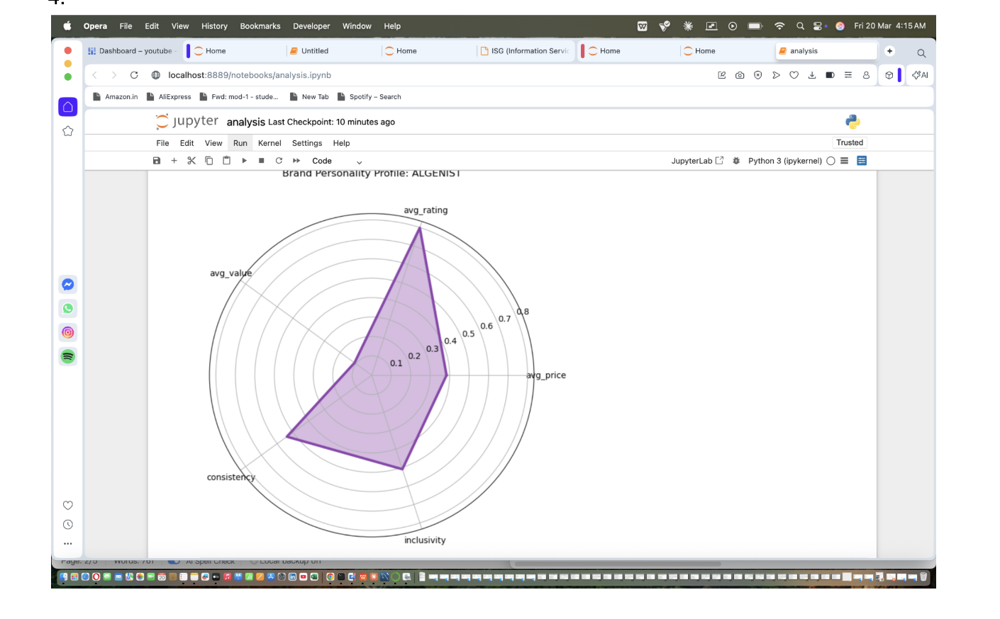

Cosmetics Product Intelligence & Market Strategy
An end-to-end data and analytics project evaluating 1,400+ cosmetic products. This project transitions from raw data validation in SQL to advanced exploratory data analysis (EDA) in Python, concluding with executive-level strategy visualizations.

Project Overview
This repository focuses on identifying "Value Creators" in the beauty industry. By analyzing the relationship between price, chemical ingredients, and user ratings, the project identifies which brands provide the best ROI for consumers and which carry the highest "Expectation Gap."
Technical Stack
Database: SQLite (Data validation & Performance Gap Analysis)

Language: Python 3.x

Libraries: Pandas, NumPy, Matplotlib, Seaborn

Documentation: SQL Schema Analysis & Strategic Business Report (PDFs)

Key Analytical Phases
1. SQL Data Validation & Aggregation
Using advanced SQL queries (including Window Functions), I performed:

Integrity Checks: Validated skin-type compatibility (binary 0/1) and handled missving values.

Performance Gap Analysis: Calculated how individual products perform against their brand average using AVG() OVER (PARTITION BY brand).

Brand Stratification: Categorized brands by price tiers and rating consistency.

2A Python Exploratory Data Analysis (EDA)
The analysis.ipynb notebook dives into the distribution of the data:

Descriptive Statistics: Analyzing price volatility and rating skews.

Correlation Mapping: Understanding the link between price points and consumer satisfaction.

Ingredient Analysis: Examining product compositions across different labels (Moisturizers, Cleansers, etc.).
2B DATA VISUALIZATION
1 Which brands create real value after adjusting for risk?

2 Which brands are high-value but also high-risk, and which are stable performers?

3  Which products should be promoted, maintained, or discontinued?

4  What type of personality does each brand have based on price and customer satisfaction?

5 Which products exceed customer expectations and which ones disappoint?

6  Which products are safest to recommend to customers?

7 Which products deliver the highest value relative to their price?

8 Which low-priced products provide unexpectedly high value?

9 At what price range does increasing price stop improving customer satisfaction?

10  How does customer satisfaction compare across cheap, mid-range, and expensive products?

STRAGETICS  BUSINESS INSIGHTS 
The project concludes with high-level visualizations designed for stakeholders:

Brand Value Impact: A risk-adjusted view of brand equity (Value vs. Risk).

Expectation Gap Map: A quadrant analysis identifying "Surprise" vs. "Disappointment" products.

The "Safe Buy Zone": A visual recommendation engine for high-probability consumer satisfaction.

Price Sweet Spot: Identifying the exact price range where rating quality peaks before diminishing returns set in.

FILE STRUCTURE
cosmetics.csv: The raw dataset containing product ingredients and skin-type flags.

SQL.pdf: Comprehensive documentation of all SQL queries and data validation steps.

analysis.ipynb: Python environment for data processing and visualization.

ANALYSISS.pdf: Final executive summary and strategic charts.
4. 1. The "Luxury Paradox" & Diminishing Returns
The data reveals that price is not a linear predictor of quality.

Insight: While prestige brands (e.g., La Mer, SK-II) command prices over $150, their average consumer ratings often parity with mid-tier brands.

Business Impact: There is a "Price Sweet Spot" (identified in your analysis between $30 and $90) where product satisfaction is maximized. Beyond this point, consumers become hyper-critical, leading to a higher "Expectation Gap."

2. Brand Value Impact (Value vs. Risk)
By calculating Net Value Impact (Rating performance minus Price-based Risk), we can categorize brands into two strategic groups:

Value Creators: Brands like Sephora Collection or Fenty Beauty that consistently provide high ratings at accessible price points. These brands have high "Brand Equity."

Value Destroyers: Brands with high Rating Volatility. If a brand has a high average rating but high variance (Standard Deviation), it indicates a "hit or miss" product line, which erodes long-term customer loyalty.

3. The "Expectation Gap" Analysis
This is a critical metric for retail strategy.

Surprise Winners: Products that are priced low but have "prestige-level" ratings. These are the best candidates for organic viral marketing and high "Subscribe & Save" retention.

The Disappointment Zone: High-priced products with average or below-average ratings. From a business perspective, these products require a formulation pivot or a price correction to avoid damaging the parent brand's reputation.

4. Market Segmentation & Skin-Type Inclusion
The SQL audit of 1,473 products showed varying levels of "Universal Compatibility."

Insight: Brands that formulate for all five skin types (Combination, Dry, Normal, Oily, Sensitive) tend to have more stable rating distributions.

Opportunity: There is a market gap for "Sensitive-Specific" luxury items, as many high-priced products contain heavy fragrances or active ingredients that lower their compatibility scores in that specific segment.

5. The "Safe Buy Zone" (Recommendation Engine)
Your "Safe Buy Zone" visual identifies a cluster of products that represent the lowest risk for a first-time buyer.

Strategic Application: This data can be used to build a "Smart Cart" recommendation algorithm. By filtering for products with a Value Score (Rating/Price) above 0.8, retailers can increase customer lifetime value (LTV) by ensuring the first purchase is a guaranteed success.
Key Findings
Value vs. Price: Higher price does not always correlate with higher ratings; the "Price Sweet Spot" analysis revealed significant value in mid-tier brands.

Brand Volatility: Some prestige brands show high rating variance, indicating inconsistent product quality across their line.
